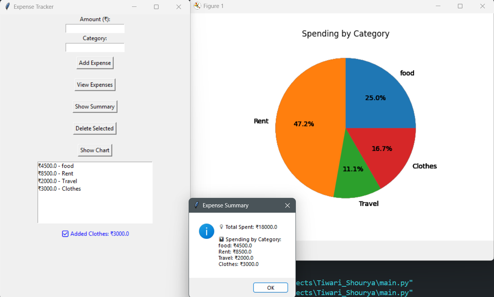

Got it 🚀 I’ll fill your README for the **Expense Tracker (CSV-based GUI app)** in the exact same structure you shared.
Here’s a polished draft for you:

---

````markdown
# Project Title: Personal Expense Tracker  

## Student Details
- **Name**: Shourya Tiwari  
- **PRN**: 24070126169  
- **Year**: SY  
- **Branch**: AIML  

---

## Problem Statement
Managing personal expenses manually often leads to errors or forgotten entries.  
This project provides a simple GUI-based application that allows students and professionals to record, view, and analyze their expenses in one place.

---

## Features
- Add new expenses with amount and category  
- View a list of all saved expenses  
- Delete unwanted expenses  
- View a category-wise summary of total spending  
- Visualize expenses using a pie chart  
- Data stored in a CSV file (persistent between runs)  
- Simple and beginner-friendly Tkinter GUI  

---

## Tech Stack
- **Python**  
- **Tkinter (for GUI)**  
- **CSV (for data persistence)**  
- **Matplotlib (for charts)**  

---

## How to Run
1. Clone the repository.  
   ```bash
   git clone https://github.com/<your-username>/FOSS-Recruitment-2025.git
````

2. Open the project folder in VS Code (or any IDE).
3. Make sure you have Python installed.
4. Install dependencies if required:

   ```bash
   pip install matplotlib
   ```
5. Run the program:

   ```bash
   python main.py
   ```
6. The GUI will open and you can start adding expenses.

---

## Project Structure

```
FOSS-Recruitment-2025/
├── main.py              # Main GUI code
├── expenses.csv         # Data storage (auto-created on first run)
├── README.md            # Documentation
└── sample_output/       # (optional) screenshots or terminal output
```

---

## Demo Screenshot / Output

**Sample GUI Output:**


Example:

```
Added: 200 - Food
Added: 500 - Transport
Summary:
Food: 200
Transport: 500
```

---

## AI Tools Used

* ChatGPT (for brainstorming project structure and explanations)

---

## Future Improvements

* Add date & description fields for each expense
* Export data to Excel format for advanced tracking
* Add monthly & yearly expense filters
* Improve UI design with modern themes
* Add notifications/reminders for budget limits

---

## Notes for Reviewers

This project runs **offline** and stores data locally in a CSV file.
It is lightweight, requires no API, and works with just Python installed.

---

## Submission Checklist

* [x] Cloned the Repository
* [x] Added my details (Name, PRN, Year, Branch)
* [x] Wrote Problem Statement
* [x] Listed Features & Tech Stack
* [x] Added clear Run Instructions
* [x] Provided Demo Output (screenshot or text)
* [x] Listed AI tools used (or None)
* [x] Explained Future Improvements
* [x] Project runs offline

```
